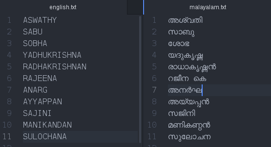

# Malayalam_To_English_Transliteration

This tool uses a Conditional Random Fields (CRF) model created by mapping the
correspondingly sounding English and Malayalam syllables. The model was trained on 3000 syllable pairs.We used a two judge accuracy evaluation and 73 of the 100 names predicted had a Levenshtein ratio higher than 0.9 according to the first judge ,while  69 of the 100 names were true according to the second judge.

## Prerequisites
* This project uses python3 and Bash.
* A copy of the [CRF++ tool](https://taku910.github.io/crfpp/) is provided along this repository. For installation and other details refer [here](https://taku910.github.io/crfpp/#install)  
## Running the tool
* run 
```
python3 testing/program.py 
```
and input a word in Malayalam script to get its English transliteration as output.
## Training
* have the malayalam words in one file and the correspondingly sounding english words in another file.


* Make sure the English words are in lower case.Hint:
```
    awk '{print tolower($1)}' filename.txt
```
* Add a '$' sign after each word in both files.Make use of
```
   awk '{print($1"$")}' filename.txt
```
 
* Use  the programs splitmalayam.py and splitenglish.py to split the syllables.
  ```
  python3 training/splitmalayalam.py <malayalamfilename>
  ```
  ```
  python3 training/splitenglish.py <englishfilename>
  ```
  * Manually checking the alignment of syllables is highly recommended as some unicode malayalam characters may     exhibit unexpected behaviours.
  * use the following command for training.
  ```
  bash training/train.sh 
  ```
  to train new model.A sample of the training file is given below.
  
   
## License
This project is licensed under the MIT License - see the [LICENSE.md](LICENSE.md) file for details

## Acknowledgments
This transliteration project was done along with my team mate [Govind GS](https://github.com/govind4873) during the one month Natural Language Processing internship at ICFOSS(International Center for Free and Open Source Software,Trivandrum).Project mentors Deepu Shaji and Anju RC gave immense support under the guidence of project head Dr. Rajeev R R.
